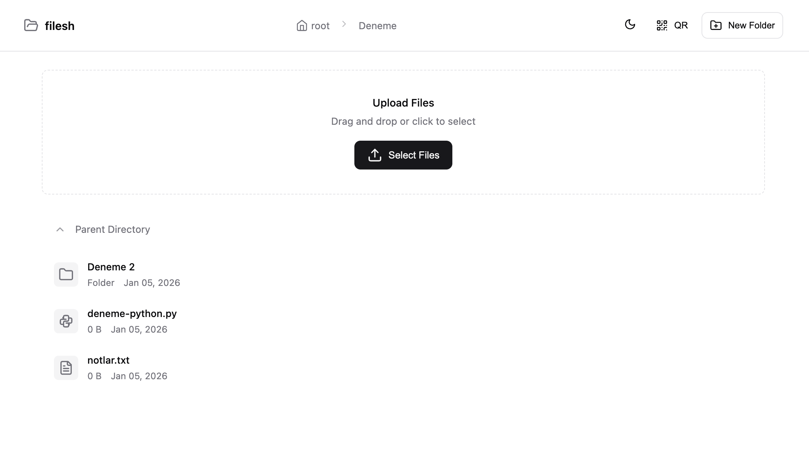
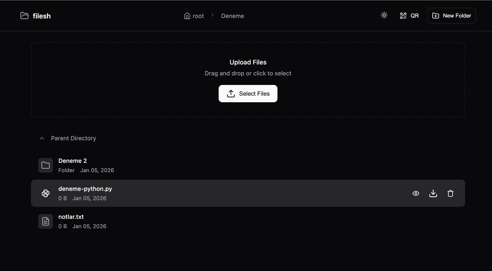
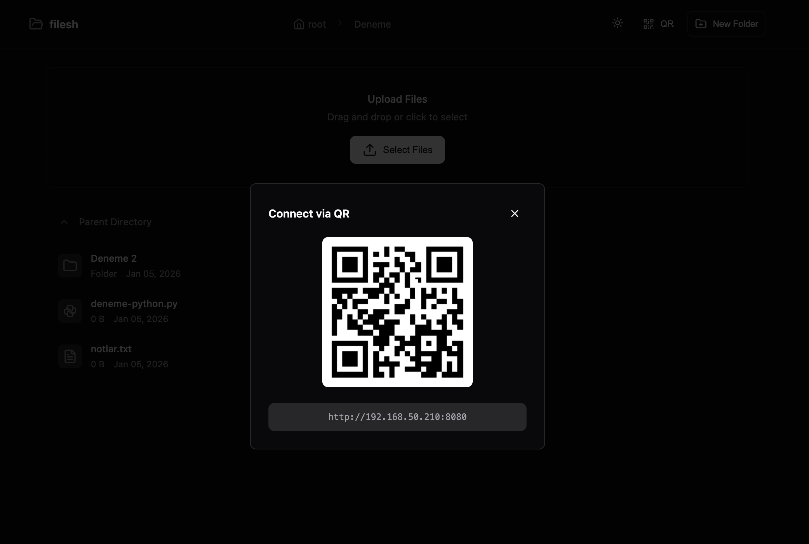

# filesh

Simple and modern LAN file sharing server with a beautiful web UI.

Share files and folders across your local network with ease. Just run `filesh` and access from any device on the same network.

## Screenshots

| Light Mode | Dark Mode |
|------------|-----------|
|  |  |

### QR Code for Mobile Access


## Features

- **Modern Web UI** - Clean, responsive interface with light/dark mode
- **Drag & Drop Upload** - Simply drag files to upload
- **Multi-file Upload** - Upload multiple files at once with progress bar
- **File Preview** - Preview images, videos, audio, and text files
- **QR Code** - Scan to connect from mobile devices instantly
- **Create Folders** - Organize files by creating new folders
- **Delete Files** - Remove files and folders from the web interface
- **File Icons** - Distinct icons for different file types
- **Cross-platform** - Works on Windows, macOS, and Linux

## Installation

```bash
pip install filesh
```

## Usage

### Basic Usage

Share current directory on port 8080:

```bash
filesh
```

### Options

```
filesh [OPTIONS] [DIRECTORY]

Arguments:
  DIRECTORY          Directory to share (default: current directory)

Options:
  -p, --port PORT    Port to run server on (default: 8080)
  -H, --host HOST    Host to bind to (default: 0.0.0.0)
  --hidden           Show hidden files
  -q, --quiet        Quiet mode - minimal output
  -v, --version      Show version
  -h, --help         Show help message
```

### Examples

```bash
# Share current directory
filesh

# Share on a different port
filesh -p 3000

# Share a specific folder
filesh ~/Downloads

# Share with custom port and folder
filesh -p 3000 ~/Music

# Show hidden files
filesh --hidden

# Quiet mode (minimal output)
filesh -q
```

### Output

```
  filesh v1.0.0
  ────────────────────
  Sharing: /home/user/Downloads
  Local:   http://127.0.0.1:8080
  Network: http://192.168.1.100:8080

  Press Ctrl+C to stop
```

Open the Network URL on any device connected to the same network to access the shared files.

## How It Works

1. Run `filesh` in your terminal
2. Note the Network URL displayed
3. Open the URL on any device in the same network
4. Browse, upload, download, and manage files

## Requirements

- Python 3.8+
- Flask 2.0+

## License

MIT License - see [LICENSE](LICENSE) for details.

## Contributing

Contributions are welcome! Feel free to open issues or submit pull requests.

## Links

- [PyPI](https://pypi.org/project/filesh/)
- [GitHub](https://github.com/kutaykoca/filesh)
